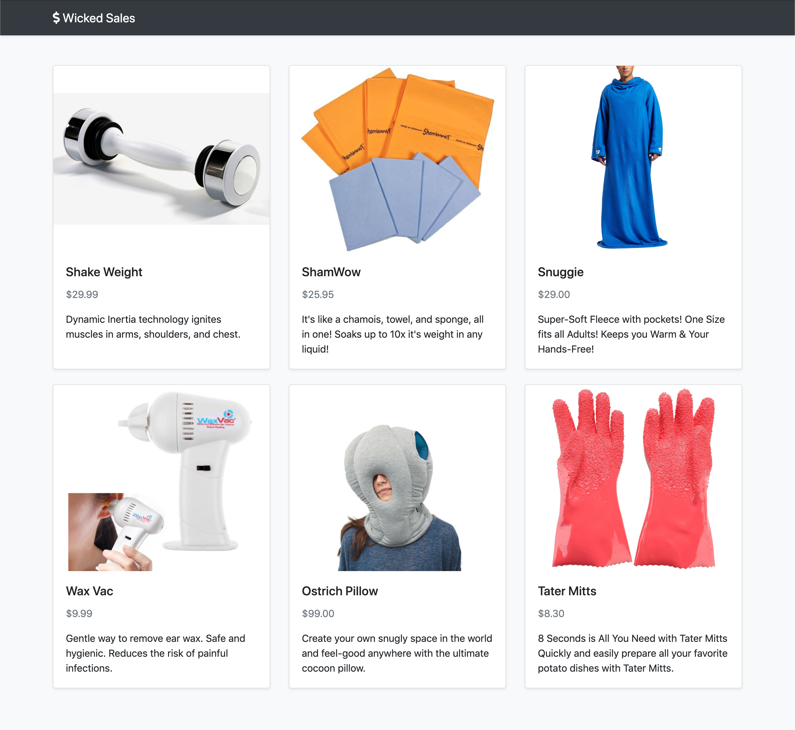

# User can view the products for sale - Front End.

## Implementation

For this feature you will be building a React interface that requests a list of products from your back end and renders them in a grid layout using [Bootstrap's Grid System](https://getbootstrap.com/docs/4.3/layout/grid/) and [Card component](https://getbootstrap.com/docs/4.3/components/card/).

## Tips

When you are creating new components, change your `App`'s render method to render only that component with hard-coded props. That way, you don't have to write a lot of code before you get visual feedback.

Use the Network tab of your browser's Dev Tools to see the data coming back from the back end.

When dealing with images of different sizes and aspect ratios, try the `object-fit` CSS property. You can read about it on MDN.

## Example

  

### 💰 Motivation

Users visiting the site will want to see a catalog of the available products.

### 🖼 Figma

The figma for this feature can be found [here](https://www.figma.com/file/BKByCT0h5swDTLY1XHGibRRr/wicked-sales?node-id=0%3A1).

### ✅ Task List

- Check out a branch from `master` named `view-products-front-end`.
- Define an `App` class component in `client/components/app.jsx`. `App` will have no initial state for now.
- Define a stateless `Header` component in `client/components/header.jsx` that displays the store's name and logo. Add `Header` to `App`'s render method.
- Define a stateless `ProductListItem` component in `client/components/product-list-item.jsx` that renders a single product card.
- Define a stateful `ProductList` component in `client/components/product-list.jsx` that will render a grid of `ProductListItems`. Give it an initial state of `products` set to an empty `Array`.
- Define a method in `ProductList` named `getProducts` that retrieves all products by sending a `GET` request to `/api/products`.
- Add a `componentDidMount` method to `ProductList` that calls `getProducts`.
- Add `ProductList` to `App`'s render method.
- Push all commits to `origin view-products-front-end`.
- Open a Pull Request from `view-products-front-end` to `master`.
- After getting your Pull Request approved, merge it into `master`, then check out and pull master locally before moving on.
