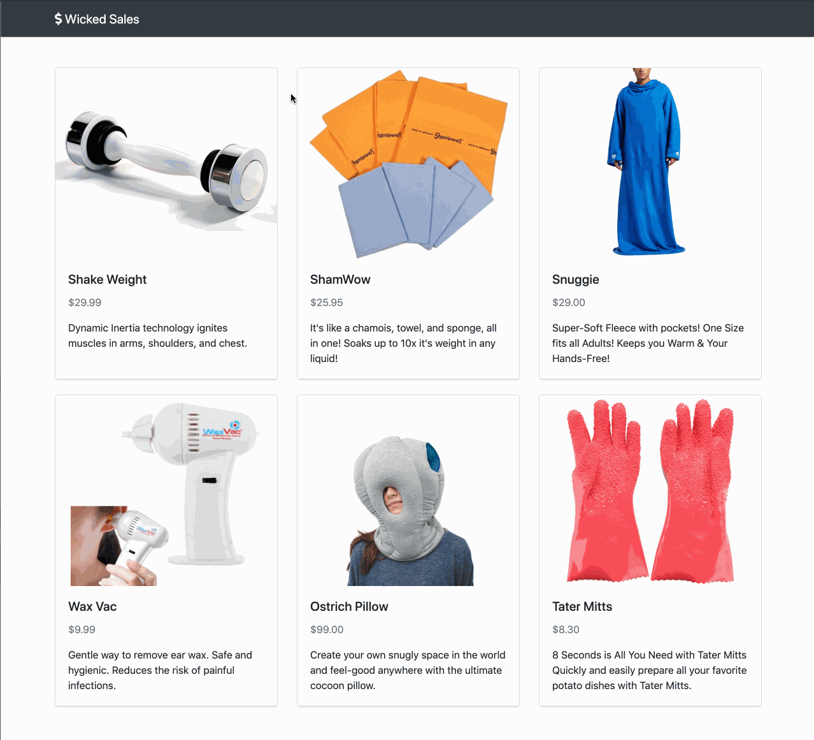

# User can view the details of a product - Front End.

## Implementation

For this feature you will be adding a second "view" to your React front end. The `App` will maintain some state indicating whether the user should see the catalog view or a details view. `App` will also define a callback to handle user clicks. Clicking on a specific product should replace the catalog with the details of that product.

## Tips

Use the React Dev Tools in your browser to inspect the state and props of your components as you interact with them.

When you are creating new components, change your `App`'s render method to render only that component with hard-coded props. That way, you don't have to write a lot of code before you get visual feedback.

Use the Network tab of your browser's Dev Tools to confirm the request that you are sending to the back end.

## Example

  

### 💰 Motivation

If a user is interested in an item in the catalog, they may want to learn more about it.

### 🖼 Figma

The Figma for this feature can be found [here](https://www.figma.com/file/BKByCT0h5swDTLY1XHGibRRr/wicked-sales?node-id=3%3A104).

### ✅ Task List

- Check out a branch from `master` named `view-details-front-end`.
- Define a stateful `ProductDetails` component in `client/components/product-details.jsx` with an initial state that includes a `product` set to `null` and an initial render method that returns `null`.
- Add a `componentDidMount` method to `ProductDetails` that retrieves the details of a specific product by `productId` from the server with a `GET` request. _e.g._ `"/api/products?productId=1"`
- Complete the implementation of `ProductDetails`'s render method to conditionally render a view of the product's details (as soon as the details are loaded from the server).
- Add a property to `App`'s initial state named `view` that is an `Object` with two properties; `name` and `params`. `name` is a `String` set to `"catalog"` and `params` is an empty `Object`. _i.e._ `{ name: 'catalog', params: {} }`
- Define a `setView` method in `App` that takes two parameters; `name` and `params`. `setView` replaces `App`'s `view` state with the new `name String` and `params Object`.
- Pass `App`'s `setView` method through `ProductList` via props so that when a user clicks on a `ProductListItem`, `App`'s `view` state gets replaced with `{ name: 'details', params: { productId: product.productId } }`
- Modify `App`'s render method to conditionally render either the `ProductList` or the `ProductDetails` based on whether `App`'s current `view.name` state is `"catalog"` or `"details"`. If the `ProductDetails` component is being rendered, pass it `App`'s `view.params` state via props as well as `App`'s `setView` method.
- Modify `ProductDetails`'s `componentDidMount` method to request product details based on the props it now receives from `App`.
- Ensure that when the user clicks "Back to catalog" in `ProductDetails`, `App`'s `setView` callback gets called with `"catalog"` and an empty `Object` to switch the user back to the `ProductList` view.
- Push all commits to `origin view-details-front-end`.
- Open a Pull Request from `view-details-front-end` to `master`.
- After getting your Pull Request approved, merge it into `master`, then check out and pull master locally before moving on.
